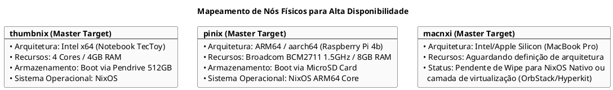

cat << 'EOF' > topology_inventory.md
# INVENTÁRIO TÉCNICO E PLANO DE ORQUESTRAÇÃO DE INFRAESTRUTURA HÍBRIDA (HA)
# AMBIENTE: CLUSTER MICROK8S MULTI-ARQUITETURA (X86_64 / AARCH64)
# REDE OVERLAY: MESH TUNNEL VIA TAILSCALE (SDN)

## 1. DIAGRAMA DA TOPOLOGIA GERAL DA REDE

```puml
@startuml
skinparam BackgroundColor #FFFFFF
skinparam BoxPadding 15
skinparam ComponentBackgroundColor #F5F5F5
skinparam ComponentBorderColor #333333
skinparam ComponentFontColor #000000
skinparam LineColor #111111

title Orquestração de Infraestrutura Híbrida e Malha de Rede SDN (Tailscale)

box "Host Principal: leonix (Ryzen 9 / 72GB RAM)" #F0F0F0
    component "[Control-Plane Lider]\nnk8s (100.100.1.16)" as nk8s #LightGreen
    component "[Control-Plane 2]\nok8s (100.100.1.166)" as ok8s #LightGreen
    component "[Worker Local]\nkub (100.100.1.15)" as kub
    component "[Gargalo - Descontinuar]\nwk8s (Instável/Multipass)" as wk8s #LightRed
end box

box "Nós Bare-Metal (Locais)" #E8E8E8
    component "[Control-Plane 3]\nthumbnix (TecToy x86_64)" as thumbnix
    component "[Control-Plane 4]\npinix (Raspberry Pi 4 ARM64)" as pinix
    component "[Control-Plane 5]\nmacnxi (MacBook Pro)" as macnxi
end box

box "Extensão de Nuvem Pública (WAN)" #DDDDDD
    component "Google Compute Engine\nInstâncias: deb, cos, veg" as gce
    component "Amazon Web Services\nInstâncias EC2: t4g.nano" as aws
end box

nk8s <--> ok8s : MicroK8s HA Sync
nk8s <--> kub : Flannel/Calico CNI
thumbnix .[#Blue].> nk8s : Cluster Join Target
pinix .[#Blue].> nk8s : Cluster Join Target
macnxi .[#Blue].> nk8s : Virtualization Setup
gce <.[#Orange].> nk8s : Tailscale Mesh
aws <.[#Orange].> nk8s : Tailscale Mesh
@endum
```

---

## 2. MAPEAMENTO ATÔMICO DOS ATIVOS DE COMPUTAÇÃO

### Camada 1: Virtualização Aninhada (Host Principal: `leonix`)
*   **Pilha Estrutural**: NixOS Workstation → QEMU Hipervisor → Kubuntu OS Base → Incus/LXD Container Engine → Ubuntu Cloud Image → Snapd → MicroK8s Core.
*   **Nós Operacionais**:
    *   **`nk8s` (100.100.1.16)**: Master Líder do cluster. Gerenciado declarativamente via `kubnt_cloud_init` e templates de automação `kbunt_preseed`.
    *   **`ok8s` (100.100.1.166)**: Master secundário ativo. Compartilha o barramento Incus de virtualização aninhada.
    *   **`kub` (100.100.1.15)**: Nó worker executado na camada de runtime nativa do QEMU, omitindo isolamento LXC interno.
    *   **`wk8s` (Condenado)**: Windows Server 2025 → Multipass VM → Ubuntu Core instance. **Status técnico**: Falhas recorrentes de sincronização de estado devido à sobreposição de camadas de emulação de disco e CPU do Multipass sobre o hipervisor subjacente. Alvo prioritário de desativação.

### Camada 2: Nós Físicos Destino (Bare-Metal Locais)



### Camada 3: Provedores de Nuvem Pública (VPC Extension)
*   **Google Compute Engine (GCE)**: 3 Instâncias virtuais ativas (`deb`, `cos`, `veg`). Planejamento técnico prevê transplante declarativo automatizado do sistema para NixOS via rotinas de bootstrap.
*   **Amazon Web Services (AWS)**: Declaração de infraestrutura via Terraform validada (Região `eu-central-1`). Utiliza instâncias baseadas em Graviton (`t4g.nano`) para garantir baixo custo operacional e alta eficiência volumétrica rodando a AMI estável do NixOS ARM64 upstream.

---

## 3. STATUS DA CAMADA DE ORQUESTRAÇÃO (`KUBECTL GET PODS`)

Métricas capturadas do plano de controle mostram estabilidade nos serviços centrais de banco de dados e roteamento, com degradação pontual em pods de rede causada pelos timeouts do nó instável `wk8s`.

| Namespace | Nome do Pod | Status | Restarts | Uptime | Diagnóstico de Engenharia |
| :--- | :--- | :--- | :--- | :--- | :--- |
| **cnpg-system** | `cnpg-controller-manager-55dc97c888-6h2th` | Running 🟢 | 1 | 9h | Controlador do CloudNativePG estável. Sincronização síncrona do banco de dados operacional. |
| **kube-system** | `calico-kube-controllers-8496b98c8c-kcvh2` | Running 🟢 | 0 | 9h | Componente central do CNI saudável. |
| **kube-system** | `calico-node-lmrk8` | Running 🟢 | 8 | 2d18h | **Alerta técnico**: Contador de reinícios elevado. Sintoma gerado pela perda intermitente de conectividade do nó `wk8s`. |
| **kube-system** | `calico-node-pg4mb` | Running 🟢 | 5 | 2d18h | Instabilidade residencial absorvida pelo Calico DaemonSet. |
| **kube-system** | `calico-node-r6tfh` | Running 🟢 | 3 | 2d18h | Operação nominal com flutuações residuais de rede. |
| **kube-system** | `coredns-84dbc6f76d-qfdj7` | Running 🟢 | 8 | 2d23h | DNS interno do cluster impactado pela latência e perdas de pacotes no nó Windows. |
| **kube-system** | `meu-headlamp-5cdbdf5d75-fvmm4` | Running 🟢 | 1 | 9h | Console gráfico de telemetria e administração ativo. |

---

## 4. INVENTÁRIO DO BARRAMENTO DE REDE TAILSCALE (SDN)

Listagem de controle extraída via daemon operacional:

*   **`100.100.1.2`   - leonix**: Estação de Trabalho Principal / Host dos Hypervisors (Online 🟢)
*   **`100.100.1.15`  - kub**: Nó worker local em execução nativa (Online 🟢)
*   **`100.100.1.16`  - nk8s**: Nó Master Líder / Control-Plane Central (Online 🟢)
*   **`100.100.1.166` - ok8s**: Nó Master Secundário / Replicação de Estado (Online 🟢)
*   **`100.100.1.167` - ubun1x**: Instância de suporte operacional e provisionamento LXD (Online 🟢)
*   **`100.100.1.17`  - win**: Máquina base Windows Server virtualizada (Online 🟢)
*   **`100.100.1.12`  - leonk8s**: Estação legada de testes (Offline 🔴)
*   **`100.100.1.1`   - ali**: Roteador/Gateway redundante de infraestrutura (Offline 🔴)
*   **`100.100.1.10`  - deb**: VM Destino alocada no Google Cloud Engine (Offline 🔴)
*   **`100.100.1.182` - veg**: VM Destino alocada no Google Cloud Engine (Offline 🔴)

---

## 5. PLANO EXECUTIVO DE CURTO PRAZO

1.  **Isolamento de Erro (Drenagem de Nó)**: Executar o `kubectl drain` e descontinuar o nó `wk8s` para normalizar as métricas de restart do Calico e estabilizar a resolução interna do CoreDNS.
2.  **Padronização Declarativa do Host x86_64**: Estruturar a configuração de boot do pendrive do `thumbnix` via NixOS, integrando o módulo nativo do Incus de forma imutável.
3.  **Bootstrap Cross-Architecture (ARM64)**: Mapear a compilação do nó do `pinix` (Raspberry Pi 4) garantindo suporte completo a binários multiarquitetura no cluster através do plano de controle líder (`nk8s`).

# COMPLEMENTO DO ARC.MD: ESTRATÉGIAS DE IMPLANTAÇÃO CLOUD (AWS & GCP)
## CONTEXTO DE PRODUÇÃO — PLATAFORMA FIBO (HA MULTI-CLOUD)

Este documento complementa o inventário do `arc.md` estabelecendo os padrões determinísticos para o desdobramento das fronteiras de nuvem da plataforma. Toda a infraestrutura segue o princípio de Imutabilidade do NixOS sobreposto à malha SDN criptografada do Tailscale.

---

### 1. ESTRATÉGIA AWS: PROVISIONAMENTO DECLARATIVO VIA DEPLOYMENT ENGINE

#### 1.1. Alinhamento de Ciclo de Vida da Imagem (NixOS AMIs)
Para evitar quebra de build e mitigar desvios de configuração, a Fibo adota a política de AMIs semanais oficiais do canal estável do NixOS. Como as imagens mais antigas que 90 dias sofrem Garbage Collection automático upstream, o provisionamento da infraestrutura deve, obrigatoriamente, buscar a AMI dinamicamente por meio de filtros ou data sources do Terraform/OpenTofu.

#### 1.2. Definição Base OpenTofu/Terraform (AWS EC2 ARM64)
O nó da AWS será instanciado em arquitetura AARCH64 (t4g/t4g.nano) aproveitando a eficiência energética e custo-benefício dos processadores AWS Graviton.

```hcl
provider "aws" {
  region = "sa-east-1" # Região de Baixa Latência (São Paulo) para manter quórum estável
}

# Captura dinâmica da AMI NixOS oficial (Garante imunidade ao GC de 90 dias)
data "aws_ami" "nixos_stable_arm64" {
  owners      = ["427812963091"] # ID Oficial do Owner NixOS na AWS
  most_recent = true

  filter {
    name   = "name"
    values = ["nixos/26.05*"] # Alinhado com a versão alvo estável
  }
  filter {
    name   = "architecture"
    values = ["arm64"]
  }
}

resource "aws_instance" "fibo_cloud_aws" {
  ami           = data.aws_ami.nixos_stable_arm64.id
  instance_type = "t4g.nano" # Instância de quórum leve baseada em Graviton

  # Injeção automática da configuração declarativa inicial
  user_data = file("./aws-nixos-bootstrap.nix")

  tags = {
    Name = "fibo-aws-node"
    Role = "control-plane-ceph-osd"
  }
}
```

---

### 2. ESTRATÉGIA GCP: ORQUESTRAÇÃO FLEET-SCALE VIA NAVI ENGINE

#### 2.1. O papel do Navi Manual no Fluxo da GCP
Para a Google Cloud Platform, a Fibo adota o **Navi** como a engine de gerenciamento de frotas unificada (Unified Deployment Tool). O Navi estende os limites do Colmena, controlando todo o ciclo de vida da instância diretamente de uma única avaliação Nix:
1. Provisionamento do hardware no Compute Engine.
2. Instalação e substituição declarativa do NixOS.
3. Gerenciamento do segredo do Tailscale em tempo de build.
4. Ativação concorrente protegida por Daemon.

#### 2.2. Implementação do Flake de Frota (GCP / Navi Integration)
Abaixo está o design estrutural do Flake avaliado pelo Navi para governar o nó da GCP de forma atômica e declarativa:

```nix
{
  inputs = {
    nixpkgs.url = "github:nixos/nixpkgs/nixos-unstable";
    navi.url = "github:cafkafk/navi"; # Carrega a engine de provisionamento unificado
  };

  outputs = { self, nixpkgs, navi, ... }: {
    # Definição Hive compatível com Colmena/Navi
    naviHive = navi.lib.makeHive {
      meta = {
        nixpkgs = import nixpkgs { system = "x86_64-linux"; };
      };

      # Nó Operacional GCP Declarativo
      fibo-gcp-node = { pkgs, ... }: {
        deployment = {
          targetHost = "100.100.1.X"; # IP fixo que será atribuído via Tailscale
          
          # Provedor nativo do Navi integrado no ciclo de avaliação Nix
          provider = {
            type = "gcp";
            project = "fibo-platform-production";
            region = "southamerica-east1"; # São Paulo (Alinhamento de ping contra Casa/AWS)
            machineType = "e2-micro";
          };
        };

        # Configuração do Sistema Operacional NixOS
        networking.hostName = "g8s";
        services.tailscale.enable = true;

        # Acoplamento das camadas core para receber o MicroCeph no container interno
        virtualisation.incus.enable = true;
        
        # Módulos de Storage permanentes no Kernel Host
        boot.kernelModules = [ "rbd" "ceph" ];
      };
    };
  };
}
```

Para aplicar a infraestrutura da GCP do zero até o estado final operacional de produção, o operador executa um único comando centralizado:
```bash
navi provision --on fibo-gcp-node
```

---

### 3. MATRIZ DE COMPATIBILIDADE DE RUNTIME (KERNEL & CONTAINER LAYER)

A infraestrutura atua na vanguarda da estabilidade e performance do Linux, casando as propriedades modernas de isolamento do Kubernetes com a resiliência geográfica:

*   **Kernel Linux 7.1 (NixOS Base):** O host bare-metal e as instâncias cloud rodam sobre o subsistema do Kernel 7.1. Isso blinda o cluster contra estouros de concorrência com o fechamento do `/proc/PID/mem`, otimiza drasticamente o I/O eliminando o overhead do FUSE através do novo stack nativo, e limpa protocolos legados indesejados de rede.
*   **Kubernetes 1.36 (Haru):** O MicroK8s v1.36 introduz estabilidade crítica para produção, trazendo a maturidade do `MutatingAdmissionPolicy` de forma nativa e o isolamento de segurança absoluto via User Namespaces em General Availability (GA). Isso garante que, se houver um escape de container dentro das nossas instâncias de aplicação (ex: na AWS), o processo agirá como root apenas dentro do escopo isolado, mapeando para um usuário comum sem privilégios no Host NixOS.


EOF
